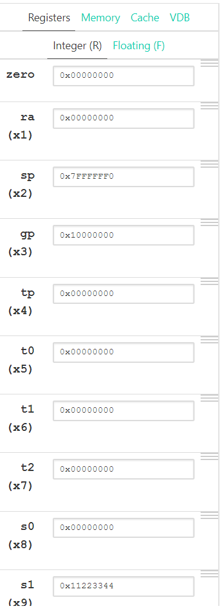

# EEC170 Lab1 Report

## Part 1

The code for Part 1 is as follows:
```asm
li s1, 28746
li s2, 37846
addi s1, s1, 20
li t0, 2049
add s1, s1, t0
li s3, x0
sub s3, s1, s2
li s4, 0
slli s4, s1, 3
li s5, 0
or s5, s1, s2
li s6, 0
not s6, s2
```

3. The contents of the registers are as follows:

  

4. The contents of register shown are consistent with the expected output of the program
a = 28746 + 20 + 2049 = 30815
b = 37846
c = a - b = -7031
d = a * 8 = 246520
e = a | b = 64479
f = ~b = -37847

## Part 2
1. The memory region with the data is as follows:


Data is found here since the .data keyword placed these data directly into the data segment of memory.
2. 
 The assembly code for part 2 is as follows:
 ```asm
.data
	data_example:
        .word 0x11223344
        .word 0xFFFFFFFF
        .word 0x33332222
.text
	lw s1, data_example
    lw s2, data_example+4
    lw s3, data_example+8
    add s4, s1, s2
    add s4, s4, s3
    sw s4, 12(gp)
```
3. The memory region is as follows:


The state of registers are as follows:

  

The sum of all 3 elements in the data is 0x44555565, and it is stored one word above the last element in the data.

## Part 3
```asm
.data
	a:
    	.word 10
        .word 9
        .word 8
        .word 7
        .word 6
        .word 5
        .word 4
        .word 3
        .word 2
        .word 1
        .word 0
.text
    la t0, a # Load the base address of a into t0
    li s0, 0 # int b = 0
    li s1, 3 # Load the constant 3
    Loop:
    	slli t1, s0, 2 # Temp reg t1 = b * 4
    	add t1, t1, t0 # Address of a[b]
        ld t2, 0(t1) # Load a[b] into t2
        addi t3, t2, 2 # Calculate a[b] + 2 and store the result in t3
        blt t3, s1, else # if a[b] + 2 <= 3, go to else
        addi s0, s0, 1 # b++
        bne zero, zero, Loop # while(1)
    else:
    	li s2, s0
```

The assembler says that label s0 used but not defined at the line `li s2, s0`, which is a bug that I could not fix.
